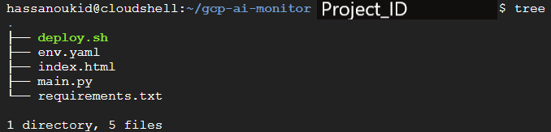
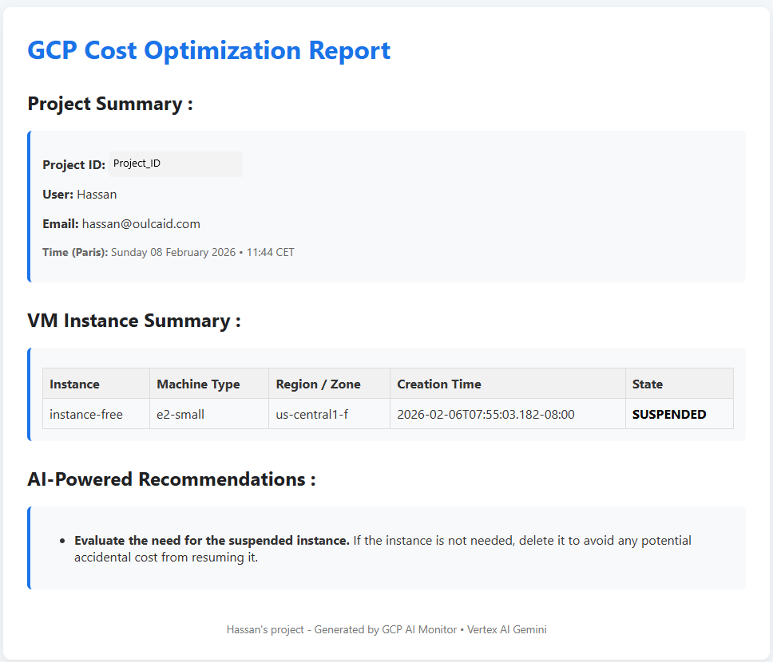

# 🚀 GCP AI Cost Monitor

A lightweight **serverless GCP monitoring dashboard** that lists Compute Engine VM instances and provides **AI-powered cost optimization recommendations** using **Vertex AI Gemini**.

Built to be:
- 🔐 **Unauthenticated (public HTTP endpoint)**
- ⚡ **Serverless (Cloud Functions Gen2)**
- 🧠 **AI-assisted (Gemini)**
- 🛠️ **Easy to deploy with a single shell script**

---

## 🖼️ Architecture Diagram




---

## 📸 Application Screenshots

### Project Summary & VM Inventory and AI Cost Optimization Recommendations


---

## 🧩 How It Works

1. User deploys the app using `deploy.sh`
2. A **Cloud Function (Python 3.11)** is deployed
3. The function:
   - Reads VM metadata via **Compute Engine API**
   - Renders an HTML dashboard
   - Sends VM data to **Vertex AI Gemini**
4. Gemini returns **cost optimization suggestions**
5. Everything is displayed in a clean web UI

---

## 🛠️ Tech Stack

- **Google Cloud Functions (Gen2)**
- **Python 3.11**
- **Compute Engine API**
- **Vertex AI (Gemini) Model : gemini-2.0-flash-lite**
- **Flask (Functions Framework)**
- **HTML / CSS**
- **Bash (deployment automation)**

---

## 🚀 Deployment (1 command)

### Prerequisites

- GCP project with:
  - Cloud Functions enabled
  - Compute Engine API enabled
  - Vertex AI enabled
- `gcloud` CLI installed and authenticated

---

🔧 Enable Required APIs

Run these commands once per project:

```bash
gcloud services enable \
  cloudfunctions.googleapis.com \
  cloudbuild.googleapis.com \
  artifactregistry.googleapis.com \
  compute.googleapis.com \
  aiplatform.googleapis.com
```

You can verify enabled APIs with:
```bash
gcloud services list --enabled
```

✅ Grant Compute Engine Read-Only Access

Required to list VM instances and metadata:
```bash
gcloud projects add-iam-policy-binding $PROJECT_ID \
  --member="serviceAccount:$SA" \
  --role="roles/compute.viewer"
```

✅ Grant Vertex AI Access (Gemini)
Required to generate AI cost optimization recommendations:
```bash
gcloud projects add-iam-policy-binding $PROJECT_ID \
  --member="serviceAccount:$SA" \
  --role="roles/aiplatform.user"
```
✅ (Optional) Logging Access

Usually already granted automatically, but safe to add:
```bash
gcloud projects add-iam-policy-binding $PROJECT_ID \
  --member="serviceAccount:$SA" \
  --role="roles/logging.logWriter"
```

### Deploy

You can deploy the app using a bash script prompt and input your infos
```bash
chmod +x deploy.sh
./deploy.sh
